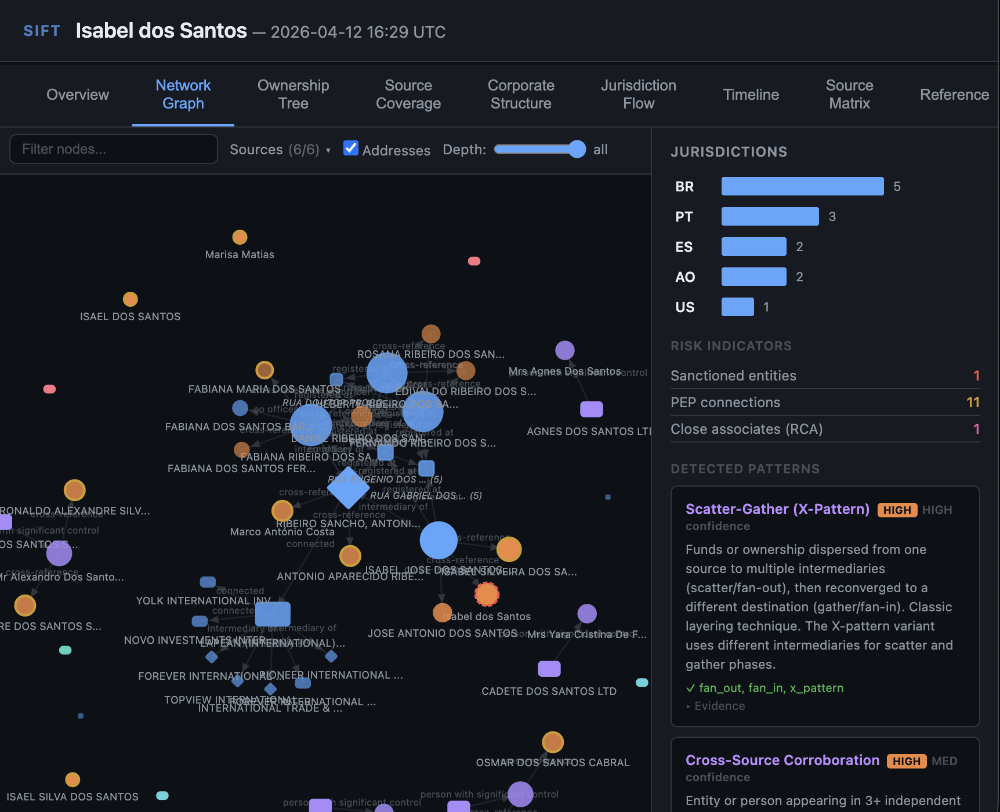
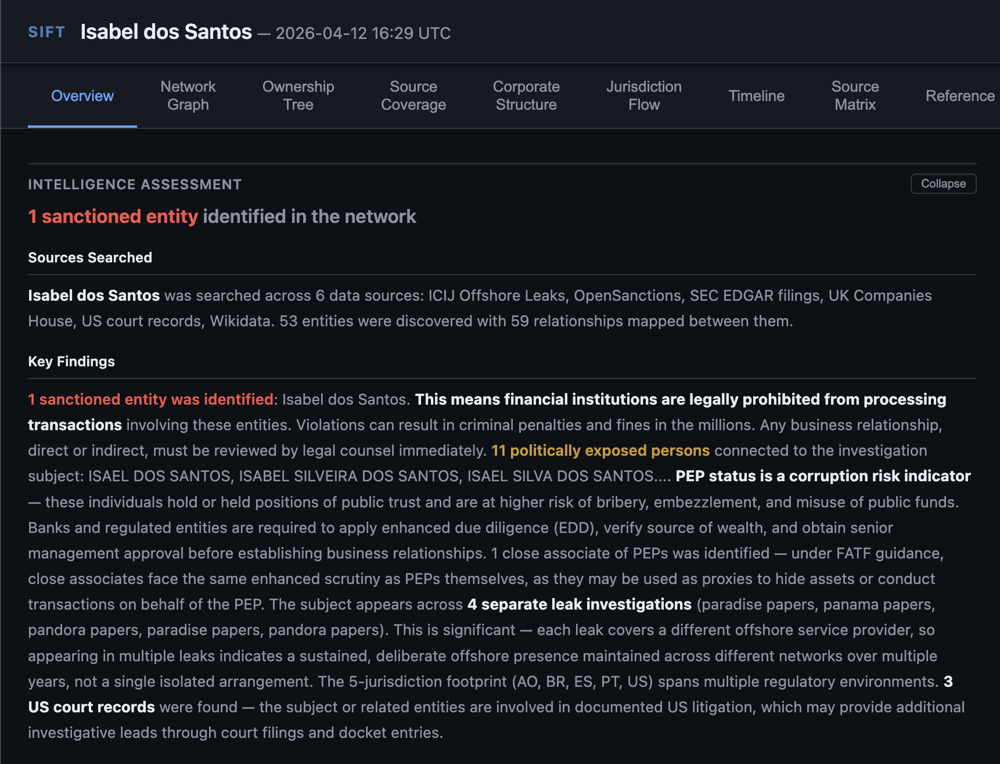
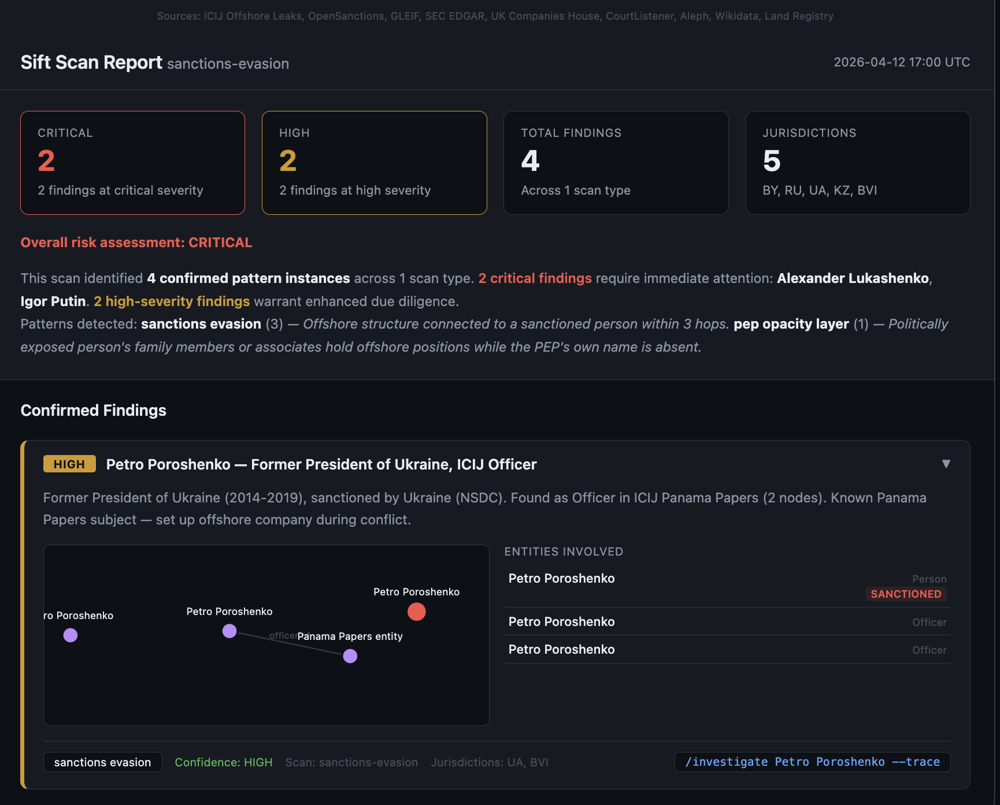
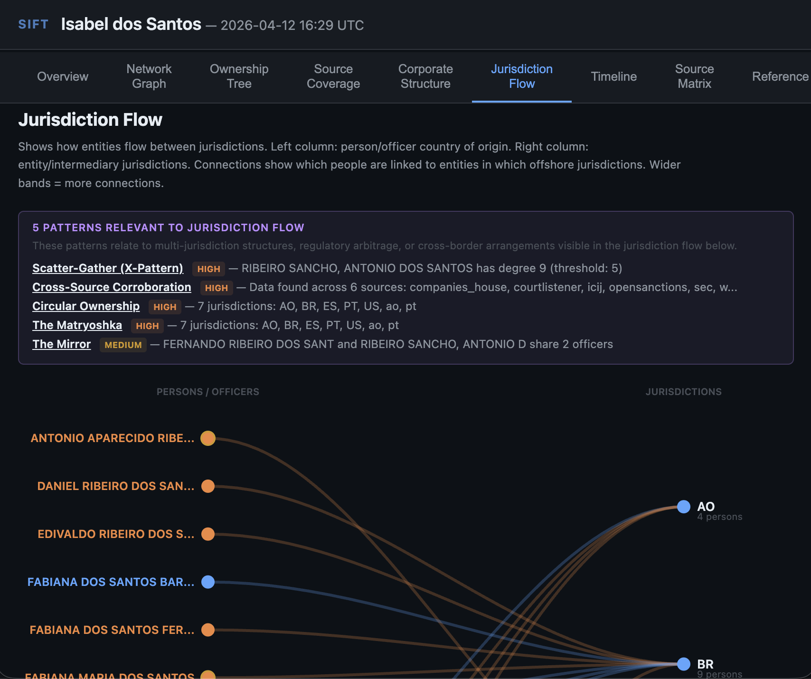
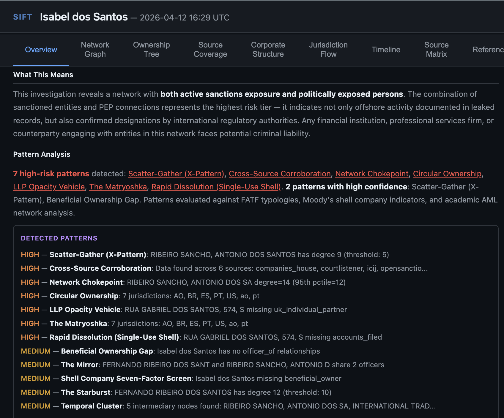

# Sift

[]()
[](LICENSE)
[]()
[]()

An [MCP server](https://modelcontextprotocol.io/) and **skill set** for **cross-referencing public financial and corporate records** — searches sanctions lists, offshore leak databases, corporate registries, court records, and more across 9 data sources. 63 tools, 18 detection patterns, and interactive D3 visualizations.



> [!NOTE]
> This is a research tool, not a compliance product. Appearing in the ICIJ database does not indicate illegality. Absence from the database does not indicate absence of offshore activity. Always verify findings against primary sources before drawing conclusions.

## What it does

Sift searches across 9 independent databases simultaneously, cross-references findings, detects structural patterns, and produces interactive visualizations — turning hours of manual cross-referencing into seconds.

Because Sift runs as an MCP server inside Claude, the results are conversational. You can ask follow-up questions, request analysis of specific findings, ask for suggestions on what to investigate next, or have the model explain what a particular pattern means. The AI understands the full context of the investigation and can reason about the connections it finds.

## Quick start

```bash
# Clone and install
git clone https://github.com/mefos-lab/sift.git
cd sift
python3 -m venv .venv && source .venv/bin/activate
pip install -e .
```

Add to `.mcp.json` in your project root:

```json
{
  "mcpServers": {
    "sift": {
      "command": "/path/to/sift/.venv/bin/python",
      "args": ["-m", "sift.server"]
    }
  }
}
```

Create a `.env` file in the sift project root:

```bash
OPENSANCTIONS_API_KEY=<your-key>          # Required — free at opensanctions.org/api
SEC_EDGAR_USER_AGENT=sift contact@you.com # Required for SEC — any name + email
COMPANIES_HOUSE_API_KEY=<your-key>        # Optional — free at developer.company-information.service.gov.uk
COURTLISTENER_API_TOKEN=<your-token>      # Optional — free at courtlistener.com
ALEPH_API_KEY=<your-key>                  # Optional — free at aleph.occrp.org
```

ICIJ, GLEIF, UK Land Registry, and Wikidata work without keys. OpenSanctions requires a free API key. The remaining sources are optional — if keys are missing, those sources are silently skipped.

## Examples

### Full investigation

```
/investigate Isabel dos Santos
```

Searches all 9 sources in parallel, then:
- Identifies **sanctions exposure** — UK FCDO asset freeze, US Kleptocracy visa list, UK director disqualification
- Finds **ICIJ Officer** records in the Paradise Papers (Malta corporate registry)
- Maps **family network** — father (former president), siblings (PEPs, sanction-linked), spouse
- Detects **patterns** — sanctions evasion, PEP opacity layer, cross-source corroboration
- Produces an **interactive visualization** with 8 analytical views



After the report, you can ask follow-up questions:

```
"What's the significance of the Malta connection?"
"Are any of her siblings also in the ICIJ data?"
"What would you recommend investigating next?"
"Generate the visualization"
```

The model has full context of the investigation and can reason about the findings, suggest next steps, explain patterns, or dig deeper into specific connections.

### Compliance screening

```
/investigate Igor Sechin --compliance --nationality RU --dob 1960-09-07
```

Rigorous structured screening using all available identifying properties. DOB and nationality are matched against the sanctions database for precise identity confirmation. The report includes:

- Exact match confirmation (DOB, nationality, birth place all verified)
- Every sanctions program listing with dates, provisions, and reasons
- ICIJ offshore exposure (or notable absence)
- Family members who are separately flagged
- Specific recommended actions based on risk level

Compliance mode uses shallower traversal (depth 1) and tighter budget for faster results when you need a quick screening answer.

### Network trace

```
/investigate Alexander Lukashenko --trace --depth 2
```

Expands outward from the seed name, hop by hop:
- **Hop 0**: Direct matches across all sources
- **Hop 1**: Connected entities — officers, shareholders, intermediaries
- **Hop 2**: Second-degree connections — co-officers, shared addresses

At each hop, cross-source bridges link findings between databases. An entity found in ICIJ is automatically checked against OpenSanctions; a Companies House officer is cross-referenced with Wikidata for PEP status.

### Multi-name connection analysis

```
/investigate Isabel dos Santos, Sindika Dokolo
```

Runs a single unified traversal with both names as seeds, then identifies **connection points** — shared entities, intermediaries, jurisdictions, or sanctions bridges where the two networks overlap. This reveals relationships that aren't visible when investigating each person separately.

### Sanctions monitoring

```
/investigate Isabel dos Santos --monitor --since 2026-01-01
```

Checks for new sanctions listings since a specific date. Returns any additions, modifications, or status changes. Useful for ongoing monitoring of previously screened subjects.

### Example: Jurisdictional footprint

```
/investigate <name> --jurisdiction
```

Groups all findings by jurisdiction and profiles each one — secrecy rankings, sanctions exposure, and cross-reference overlap. Reveals whether an entity's jurisdictional spread follows patterns associated with regulatory arbitrage.

### Example: Pattern analysis

```
/investigate <name> --patterns
```

Focused structural analysis evaluating all findings against 18 documented patterns. Reports which patterns match, with what confidence, and what evidence supports each match.

### Scan mode

```
/investigate --scan sanctions-evasion
```

Hunts for structural patterns across the data sources **without requiring a target name**. The scan generates its own seeds from the databases and cross-references findings automatically.

| Scan type | What it finds |
|-----------|--------------|
| `sanctions-evasion` | Sanctioned persons with ICIJ offshore presence |
| `pep-opacity` | PEP family members behind offshore structures |
| `nominee-shield` | Professional nominee directors across mass entities |
| `intermediary-cluster` | Formation agents managing large entity portfolios |
| `rapid-dissolution` | Short-lived UK companies with suspicious characteristics |
| `llp-opacity` | UK LLPs with opaque corporate partners in secrecy jurisdictions |
| `beneficial-ownership-gap` | Entities with no disclosed beneficial owner |
| `mass-registration` | Addresses hosting large numbers of registered entities |

Run all scans at once with `/investigate --scan all`.



## Conversational investigation

Because Sift runs inside an AI model, investigations are interactive. After any command, you can:

- **Ask for analysis**: "What does this pattern mean?" / "Why is this entity flagged?"
- **Request suggestions**: "What should I investigate next?" / "Are there any leads I'm missing?"
- **Dig deeper**: "Tell me more about the Malta connection" / "Who else is connected to that intermediary?"
- **Compare findings**: "How does this compare to the Isabel dos Santos investigation?"
- **Export results**: "Generate the visualization" / "Export as JSON"
- **Pivot to new subjects**: "Now investigate the spouse" / "Check the company that showed up at hop 2"

The model remembers the full context of the current investigation and can chain multiple searches together based on what it finds.

## Visualization

Every investigation can generate an interactive D3 visualization with 8 analytical views:

| View | What it shows |
|------|--------------|
| **Overview** | Intelligence assessment, key findings, risk level |
| **Network Graph** | Interactive force-directed graph, filterable by source and depth |
| **Ownership Tree** | GLEIF corporate hierarchy |
| **Source Coverage** | Which sources contributed which findings |
| **Corporate Structure** | Vertical org chart with pattern annotations |
| **Jurisdiction Flow** | Sankey diagram of person-to-jurisdiction connections |
| **Timeline** | Chronological narrative across all sources |
| **Source Matrix** | Cross-source entity resolution |

See the [Gallery](docs/gallery.md) for annotated screenshots of all views.



## Data sources

| Source | Coverage | Auth | Tools |
|--------|----------|------|-------|
| [ICIJ Offshore Leaks](https://offshoreleaks.icij.org/) | 810K+ entities from 5 leak investigations | None | 8 |
| [OpenSanctions](https://www.opensanctions.org/) | 320+ sanctions lists, PEP databases, enforcement records | API key | 9 |
| [GLEIF LEI Registry](https://www.gleif.org/) | Global corporate identifiers + ownership chains | None | 3 |
| [SEC EDGAR](https://www.sec.gov/edgar) | US public company filings, 10-K/10-Q/8-K | User-Agent | 8 |
| [UK Companies House](https://developer-specs.company-information.service.gov.uk/) | UK company records, officers, beneficial ownership (PSC) | Free API key | 7 |
| [CourtListener](https://www.courtlistener.com/) | US federal court records (PACER/RECAP) | Free token | 6 |
| [OCCRP Aleph](https://aleph.occrp.org/) | Investigative datasets, company records, leaked documents | Optional API key | 4 |
| [UK Land Registry](https://landregistry.data.gov.uk/) | Property transaction prices (England/Wales) | None | 2 |
| [Wikidata](https://www.wikidata.org/) | Structured data on people, companies, political roles | None | 7 |

Plus cross-source tools: `deep_trace` (multi-hop parallel network traversal), `ownership_trace`, `beneficial_owner`, `background_check`, `query` (natural language), `export_json`, `export_report`, and more. **63 tools total**.

## Pattern library

The `patterns/` directory contains 18 documented detection patterns, each with machine-readable YAML rules evaluated against the traversal graph:

| Category | Patterns |
|----------|----------|
| **Structural** | Matryoshka, Starburst, Mirror, Intermediary Cluster, Nominee Shield, Regulatory Arbitrage Chain, Temporal Cluster |
| **Sanctions & PEP** | Sanctions Evasion, PEP Opacity Layer |
| **Graph Topology** | Circular Ownership, Scatter-Gather, Network Chokepoint |
| **Shell Indicators** | Shell Company Seven-Factor Screen, Mass Registration, Beneficial Ownership Gap |
| **UK Typologies** | LLP Opacity Vehicle, Rapid Dissolution |
| **Cross-Source** | Cross-Source Corroboration, Name Variant Obfuscation |

Each pattern includes provenance citations from FATF typologies, ICIJ methodology, Moody's shell company indicators, FinCEN Files analysis, UK National Risk Assessment, and academic AML research.

Patterns evolve through a lifecycle: **PROPOSED** (single investigation) -> **CONFIRMED** (2+ investigations) -> **ESTABLISHED** (multiple leak datasets or jurisdictions). When the model identifies a new structure not in the library, it proposes adding it.



## Architecture

```
sift/
  server.py              — MCP server (63 tools)
  traversal.py           — Multi-hop parallel graph traversal engine
  errors.py              — Resilient error handling, retries, per-service rate limiting
  pattern_matcher.py     — YAML pattern evaluation engine
  scoring.py             — Confidence and risk scoring
  normalizer.py          — Entity deduplication and normalization
  visualizer.py          — D3 visualization generator
  export.py              — JSON and Markdown export
  query_router.py        — Natural language query routing
  client.py              — ICIJ Offshore Leaks API client
  opensanctions_client.py
  gleif_client.py
  sec_client.py
  companies_house_client.py
  courtlistener_client.py
  aleph_client.py
  land_registry_client.py
  wikidata_client.py

patterns/                — 18 YAML detection patterns with provenance
visualizations/          — D3 HTML template
.claude/skills/          — /investigate skill definition
tests/                   — 211 tests (mocked HTTP, no API calls)
```

### Error handling and rate limiting

All external API calls go through a centralized error handler (`sift/errors.py`) that provides:

- **Per-service rate limiting** based on documented API terms
- **Retries** with exponential backoff for transient errors (HTTP 429/500/502/503/504)
- **Service tracking** — when a source is having issues, the response includes warnings like `"ICIJ (/reconcile) is returning errors, skipping for now (2 failures)"`
- **Parallel execution** — all 9 sources queried simultaneously during seed phase, all frontier nodes expanded concurrently during traversal

## Development

```bash
# Install
python3 -m venv .venv && source .venv/bin/activate
pip install -e .
pip install pytest pytest-asyncio

# Run tests (211 tests, mocked HTTP — no API calls)
pytest tests/ -v

# Run the server directly
python -m sift.server
```

## Contributing

If you'd like to contribute, consider setting a repo-specific git
identity to keep your personal information out of the commit history:

```bash
git config user.name "your-handle"
git config user.email "your-anonymous-email"
```

## License

MIT — see [LICENSE](LICENSE).

## Acknowledgements

This tool is built on the extraordinary work of:

- The [International Consortium of Investigative Journalists](https://www.icij.org/) and the hundreds of journalists who produced the Panama Papers, Paradise Papers, Pandora Papers, Bahamas Leaks, and Offshore Leaks investigations
- [OpenSanctions](https://www.opensanctions.org/) for aggregating and publishing sanctions data as a public good
- The journalists and sources who risked their safety to make this data available — including [Daphne Caruana Galizia](https://en.wikipedia.org/wiki/Daphne_Caruana_Galizia), who was investigating the Panama Papers when she was assassinated in 2017
