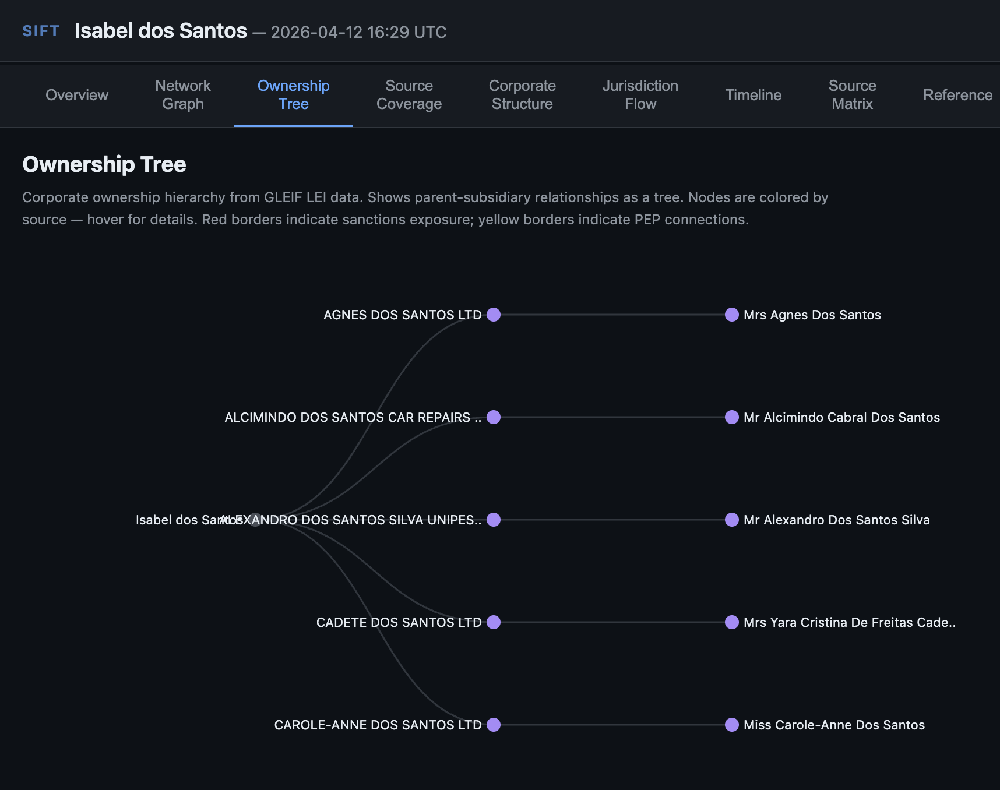
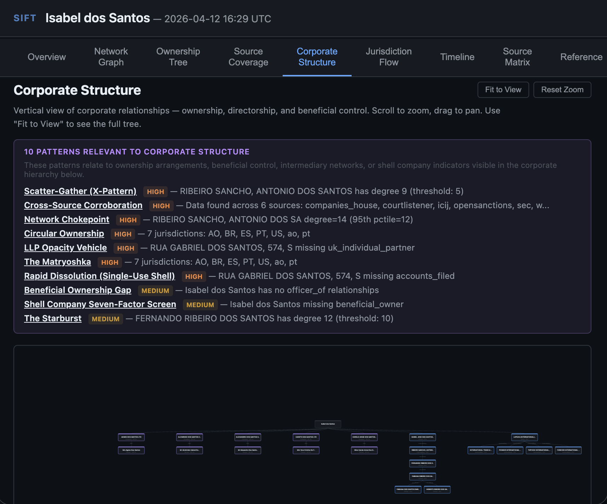
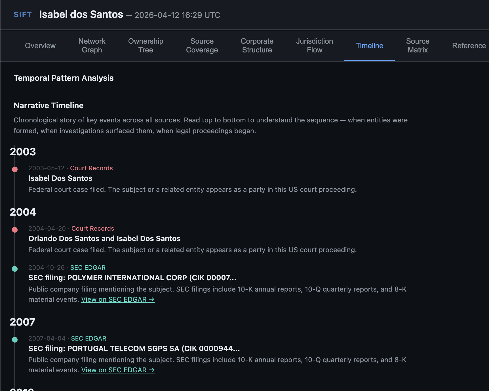
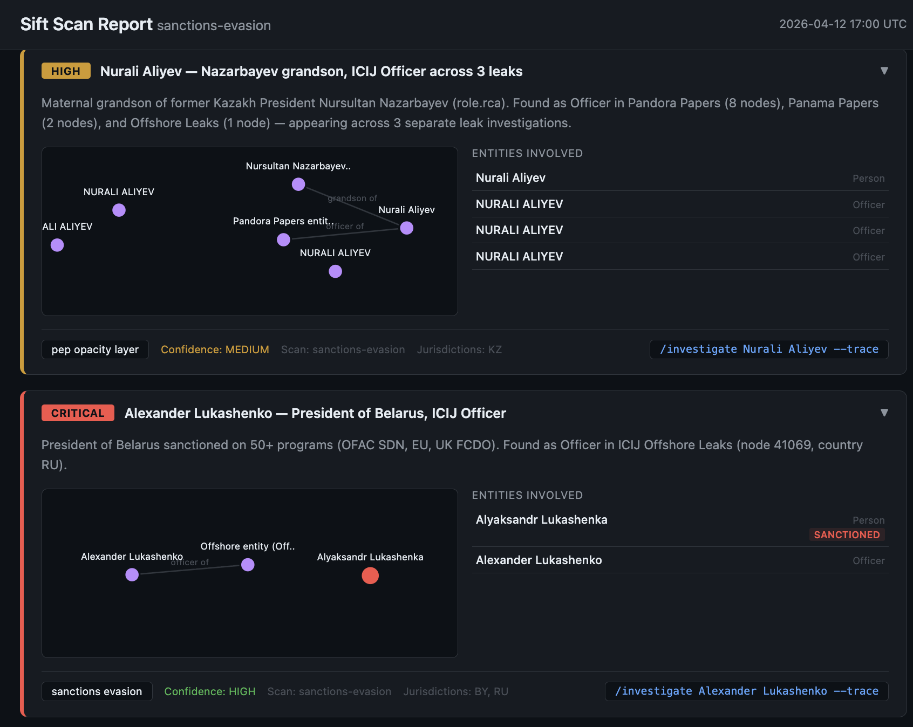

# Gallery

Screenshots from Sift investigations and scans. All examples use publicly documented cases.

## Investigation: Overview

The overview tab provides an intelligence assessment with key findings, sanctions exposure, PEP connections, and data source coverage.

## Investigation: Pattern Analysis

Automated pattern detection evaluates findings against 18 documented patterns derived from FATF typologies, ICIJ methodology, and academic AML research.

## Investigation: Network Graph

Interactive D3 network graph showing entities colored by source, sized by risk score. Jurisdictions, risk indicators, and detected patterns are displayed in the sidebar.

## Investigation: Ownership Tree

Corporate ownership hierarchy from GLEIF LEI data. Shows parent-subsidiary relationships as a tree.

## Investigation: Corporate Structure

Vertical corporate structure view with pattern annotations showing which structural patterns are relevant to the corporate hierarchy.

## Investigation: Jurisdiction Flow

Sankey diagram showing how entities flow between jurisdictions. Left column shows persons/officers, right column shows entity jurisdictions. Wider bands indicate more connections.

## Investigation: Timeline

Chronological narrative of key events across all sources — court filings, SEC filings, sanctions designations, corporate events — displayed as a scrollable timeline.

## Scan: Dashboard

The scan dashboard shows findings from automated pattern hunts. Severity distribution, jurisdiction coverage, and individual findings with evidence chains.

## Scan: Findings

Each finding includes an evidence chain, mini network graph, entities involved, pattern classification, confidence level, and a follow-up command to investigate further.

